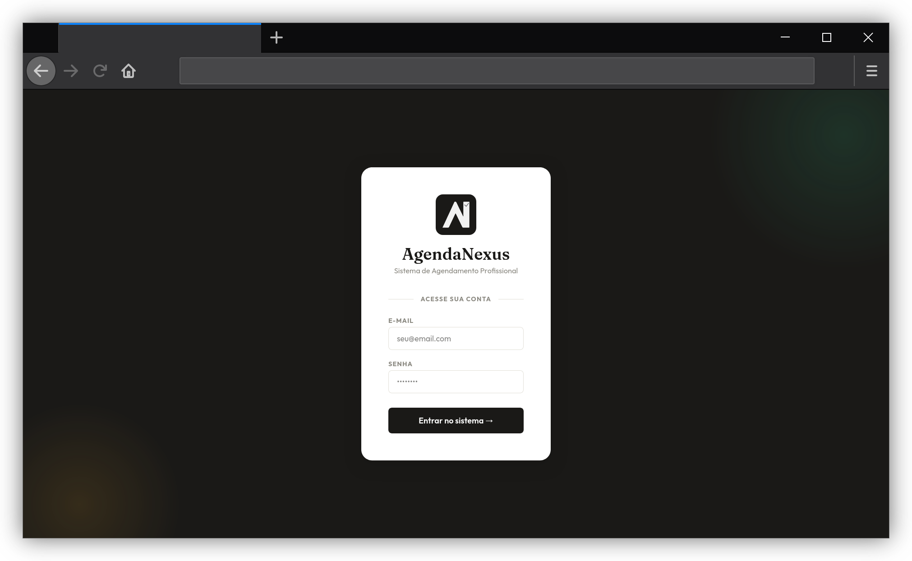
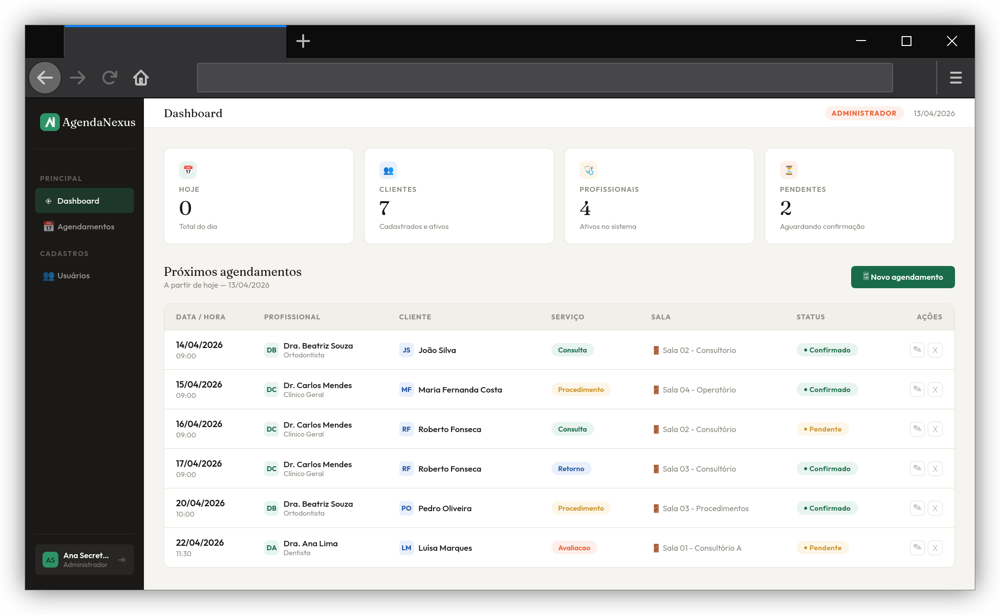
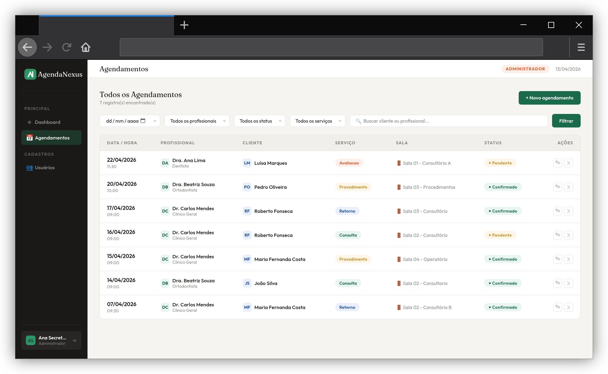
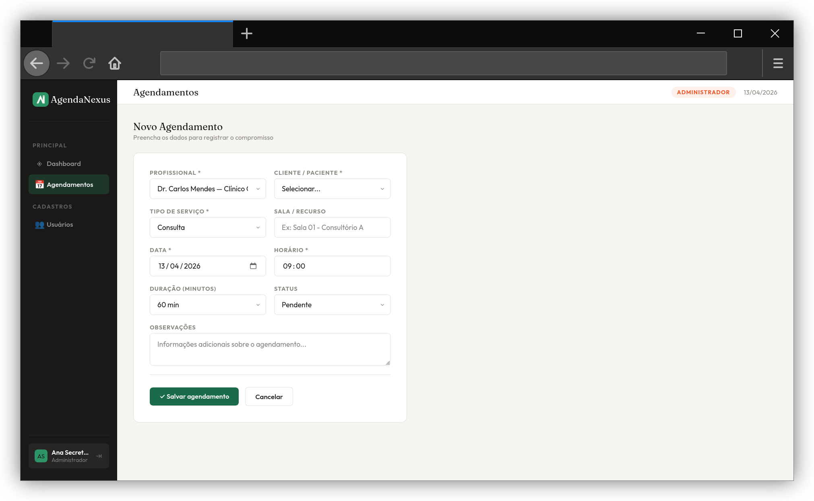
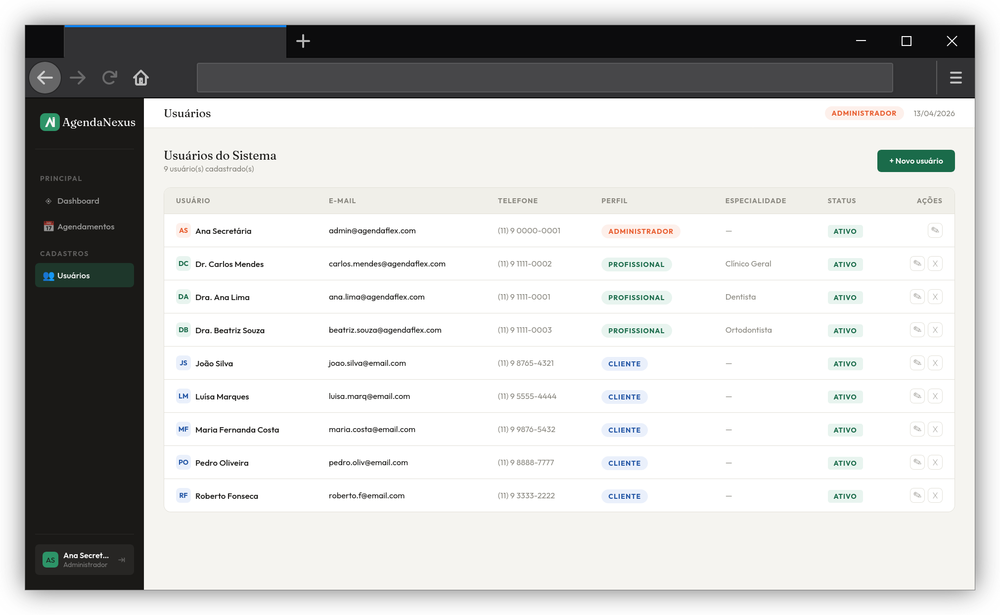
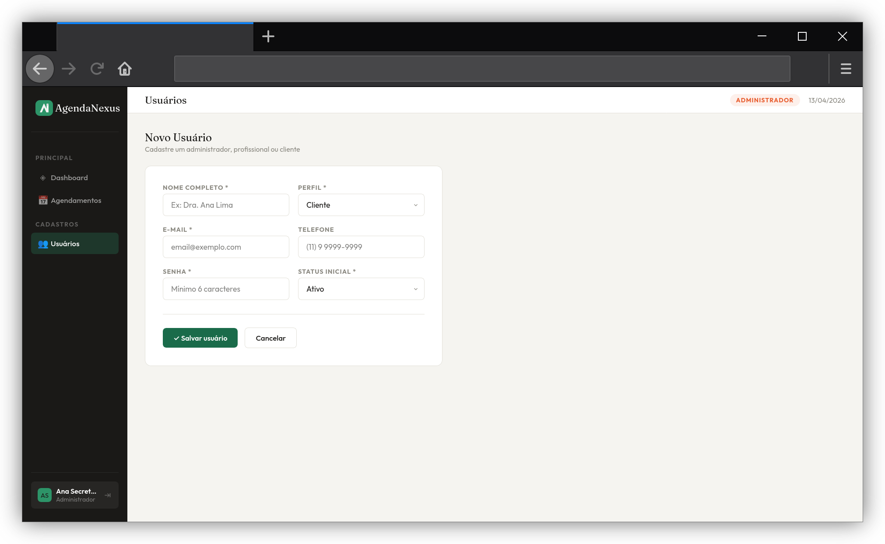
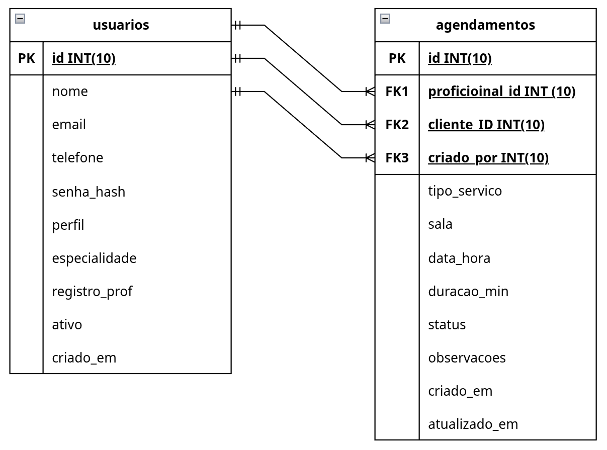

# AgendaNexus

> Sistema de Agendamento Profissional desenvolvido como Trabalho Prático da disciplina de **Back-End Frameworks** — UNIFASB / UNINASSAU.

---

## 📋 Sobre o Projeto

O **AgendaNexus** é um sistema web de agendamento desenvolvido para facilitar o gerenciamento de compromissos entre profissionais e clientes. A proposta é ser genérico o suficiente para ser adaptado a diferentes contextos — clínicas, consultórios, escritórios, salões de beleza — qualquer negócio que dependa de agendamentos com profissionais específicos.

---

## 🖥️ Telas do Sistema

### Login


### Dashboard — Visão geral (Administrador)


### Agendamentos — Listagem completa com filtros


### Novo Agendamento — Formulário de cadastro


### Usuários — Listagem (somente Administrador)


### Novo Usuário — Formulário de cadastro


---

## 🗄️ Banco de Dados

### Diagrama de Relacionamento


O banco `agendanexus` é composto por **duas tabelas** que se relacionam entre si:

| Tabela | Descrição |
|---|---|
| `usuarios` | Armazena todos os perfis do sistema (administrador, profissional e cliente) |
| `agendamentos` | Registra os compromissos vinculando profissional ↔ cliente em data/hora específica |

#### Tabela `usuarios`
| Campo | Tipo | Descrição |
|---|---|---|
| id | INT PK | Chave primária auto-incremento |
| nome | VARCHAR(100) | Nome completo |
| email | VARCHAR(150) | E-mail único, usado no login |
| telefone | VARCHAR(20) | Contato (opcional) |
| senha_hash | VARCHAR(255) | Senha criptografada com bcrypt |
| perfil | ENUM | `administrador` \| `profissional` \| `cliente` |
| especialidade | VARCHAR(100) | Área de atuação (profissionais) |
| registro_prof | VARCHAR(50) | CRO, CRM, OAB etc. |
| ativo | TINYINT(1) | 1 = ativo, 0 = inativo |
| criado_em | DATETIME | Data de cadastro |

#### Tabela `agendamentos`
| Campo | Tipo | Descrição |
|---|---|---|
| id | INT PK | Chave primária |
| profissional_id | INT FK | Referência a `usuarios` |
| cliente_id | INT FK | Referência a `usuarios` |
| tipo_servico | ENUM | `consulta` \| `retorno` \| `procedimento` \| `avaliacao` |
| sala | VARCHAR(60) | Sala ou recurso físico |
| data_hora | DATETIME | Data e horário de início |
| duracao_min | SMALLINT | Duração em minutos |
| status | ENUM | `pendente` \| `confirmado` \| `cancelado` \| `concluido` |
| observacoes | TEXT | Informações adicionais |
| criado_por | INT FK | Quem registrou |
| criado_em | DATETIME | Data do registro |

---

## 🔀 Fluxo de Navegação


---

## ⚙️ Funcionalidades

- **Autenticação** — Login com e-mail e senha (hash bcrypt + `password_verify`)
- **Dashboard** — Estatísticas filtradas por perfil + tabela de próximos agendamentos
- **Agendamentos** — Listagem com filtros por data, profissional, status e serviço (SELECT)
- **Novo agendamento** — Formulário completo de cadastro (INSERT)
- **Editar agendamento** — Atualização de dados existentes (UPDATE)
- **Excluir agendamento** — Remoção via `$_GET[id]` (DELETE)
- **Gerenciamento de usuários** — CRUD completo exclusivo para Administrador
- **Controle de acesso por perfil** — Cada perfil vê e acessa apenas o que lhe pertence

---

## 👥 Perfis de Acesso

| Funcionalidade | Administrador | Profissional | Cliente |
|---|---|---|---|
| Ver dashboard | Geral | Próprios | Próprios |
| Listar agendamentos | Todos | Próprios | Próprios |
| Cadastrar agendamento | ✅ | ❌ | ❌ |
| Editar agendamento | ✅ | ❌ | ❌ |
| Excluir agendamento | ✅ | ❌ | ❌ |
| Gerenciar usuários | ✅ | ❌ | ❌ |

---

## 🗂️ Estrutura de Arquivos

```
AgendaNexus/
│
├── index.php                    Ponto de entrada
├── login.php                    Tela de autenticação
├── logout.php                   Encerra sessão
├── dashboard.php                Painel principal
├── agendamentos.php             Listagem com filtros
├── novo_agendamento.php         Formulário de cadastro (INSERT)
├── editar_agendamento.php       Edição de agendamento (UPDATE)
├── excluir_agendamento.php      Exclusão via $_GET (DELETE)
├── usuarios.php                 Listagem de usuários (Admin)
├── novo_usuario.php             Cadastro de usuário
├── editar_usuario.php           Edição de usuário
├── excluir_usuario.php          Exclusão de usuário
│
├── includes/
│   ├── conexao.php              mysqli_connect() com o banco
│   ├── auth.php                 Verifica $_SESSION
│   ├── header.php               Sidebar + Topbar
│   └── footer.php               Fechamento HTML
│
└── assets/
    ├── style.css                CSS global
    └── images/                  Logotipo
```

---

## 🛠️ Tecnologias


| Tecnologia | Uso |
|---|---|
| PHP 8.x | Lógica de back-end |
| MariaDB 10.6 | Banco de dados relacional |
| MySQLi | Conexão e consultas ao banco |
| HTML5 + CSS3 | Interface do usuário |
| Apache HTTPD | Servidor web |

---

## 🚀 Como executar

**1. Clone o repositório**
```bash
git clone https://github.com/fg333k/AgendaNexus.git
```

**2. Mova para a raiz do Apache**
```bash
# Linux 
sudo cp -r AgendaNexus /srv/http/
ou
sudo cp -r AgendaNexus /home/usuario/www/

# Windows (XAMPP)
# Copie para C:\xampp\htdocs\AgendaNexus
```

**3. Crie o banco de dados**

Importe o script SQL disponível em `docs/agendanexus.sql` via phpMyAdmin ou terminal:
```bash
mariadb -u root -p < docs/agendanexus.sql
```

**4. Configure a conexão**

Edite `includes/conexao.php`:
```php
$servidor = "localhost";
$usuario  = "seu_usuario";
$senha    = "sua_senha";
$banco    = "agendanexus";
```

**5. Gere as senhas dos usuários de teste**
```bash
php -r "echo password_hash('12345', PASSWORD_BCRYPT);"
```

Atualize no banco:
```sql
UPDATE usuarios SET senha_hash = 'HASH_GERADO' WHERE email = 'admin@agendanexus.com';
```

**6. Acesse no navegador**
```
http://localhost/AgendaNexus
```

---

## 👨‍💻 Autores

| Nome | Perfil |
|---|---|
| Emilio Eduardo Maciel | [@emilio-eduardo-tech](https://github.com/emilio-eduardo-tech) |
| Felipe de Almeida Pereira | [@fg333k](https://github.com/fg333k) |

---

## 📄 Licença

Projeto acadêmico desenvolvido para a disciplina de **Back-End Frameworks**  
UNIFASB / UNINASSAU — 2026
